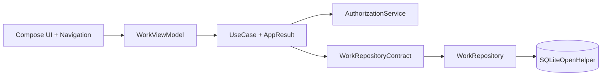

# Оренбург Банк — портал техработ


Учебное Android-приложение для планирования, согласования, просмотра и отмены
технических работ АО «БАНК ОРЕНБУРГ». Портал хранит справочник систем, заявки,
согласования и периоды делегирования в локальной SQLite БД.

Доступ к действиям ограничен матрицей ролей и принадлежностью заявки или
системы. UI выполнен на Jetpack Compose в фирменной сине-бирюзовой палитре и
поддерживает светлую и тёмную темы.
## Возможности

- справочник систем с критичностью, согласующим, заместителем и зависимостями;
- создание техработ с автоматическим формированием согласований;
- согласование, отклонение, отмена и делегирование по системам;
- список, календарь, детали работ и справочная матрица ролей;
- защищённые маршруты, валидация, Snackbar, состояния загрузки и пустых данных;
- работа без сети через локальную SQLite БД версии 3.

## Аутентификация

| Логин | Пароль | Роль |
|---|---|---|
| `admin` | `admin` | Администратор |
| `technician` | `tech` | Техник |
| `viewer` | `view` | Просмотр |

Дополнительные учебные учётные записи: `approver/approver`, `deputy/deputy`,
`author/author`, `maintainer/maintainer`. Роль определяется учётной записью;
начальная роль до входа — `VIEWER`.
## Архитектура

Зависимости создаются вручную в `AppContainer` и передаются через
конструкторы. Подробности: [docs/ARCHITECTURE.md](docs/ARCHITECTURE.md).
## Матрица ролей
| Действие | Согласующий | ЗамС | Автор | Просмотр | Админ | Ведение справочников |
|---|---:|---:|---:|---:|---:|---:|
| Согласование техработ | ✓ | ✓ |  |  | ✓ |  |
| Перевод согласований на/с зама | ✓ |  |  |  | ✓ |  |
| Просмотр техработ | ✓ | ✓ | ✓ | ✓ | ✓ | ✓ |
| Создание техработ | ✓ | ✓ | ✓ |  | ✓ |  |
| Отмена техработ | ✓ | ✓ | ✓ |  | ✓ |  |
| Просмотр справочников | ✓ | ✓ | ✓ | ✓ | ✓ | ✓ |
| Изменение справочников |  |  |  |  | ✓ | ✓ |
Права согласования и отмены дополнительно ограничены затронутыми системами.
## Структура
```text
app/src/main/java/com/example/orenburggbank/
├── data/          # SQLite, репозиторий и сущности
├── di/            # manual DI
├── domain/        # UseCase, права, валидация, AppResult
├── navigation/    # маршруты и защита экранов
├── ui/            # Compose-экраны, компоненты, тема
└── viewmodel/     # состояние UI
docs/              # архитектура, соответствие ТЗ, скриншоты
```
## Установка и запуск

Требуются Android Studio, JDK 17 и Android SDK 34.

```bash
git clone https://github.com/USERNAME/orenburggbank.git
cd orenburggbank
./gradlew test assembleDebug
```

Откройте проект в Android Studio и запустите конфигурацию `app` на устройстве
Android API 24+. Debug APK создаётся в `app/build/outputs/apk/debug/`.

> По требованию практики бинарный `gradle-wrapper.jar` исключён из Git. Перед
> первым запуском восстановите wrapper командой `gradle wrapper` либо запускайте
> проект из Android Studio.

## Тестирование

JUnit-тесты покрывают матрицу «роль × действие», системные ограничения
согласования и отмены, активное делегирование, вычисление статуса работы,
валидацию обязательных полей и дат. Команда проверки:

```bash
./gradlew test assembleDebug
```

## Документация

- [Архитектура](docs/ARCHITECTURE.md)
- [Соответствие техническому заданию](docs/TZ_MAPPING.md)
- [История изменений](docs/CHANGELOG.md)

## Автор

**Автор:** Агайдаров Даулет Азаматович  
**Группа:** 23 КСК 4  
**Учебное заведение:** Университетский колледж ОГУ  
**Место практики:** АО « ОРЕНБУРГ БАНК »  
**Год:** 2026
