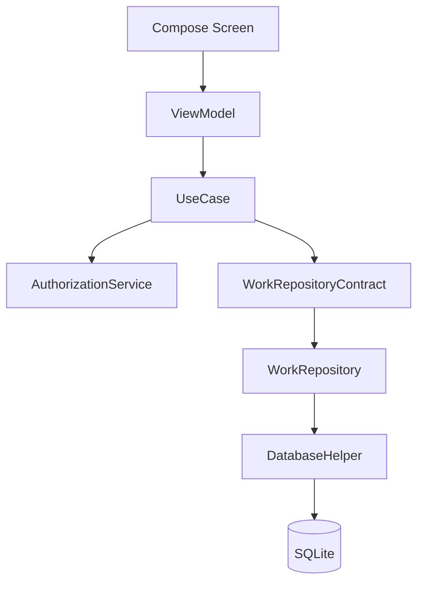

# Архитектура приложения

## Слои

### Presentation

Compose-экраны отображают состояние и передают намерения пользователя в
`WorkViewModel`. `NavGraph` задаёт маршруты и перенаправляет пользователя на
экран отказа в доступе для защищённых сценариев.

### Domain

`WorkUseCases` координирует пользовательские сценарии и возвращает
`AppResult`. `AuthorizationService` реализует матрицу ролей и ограничения по
владельцу/системе. `WorkValidator` проверяет обязательные поля и даты.

### Data

`WorkRepositoryContract` отделяет бизнес-логику от хранения. Реализация
`WorkRepository` выполняет защищённые CRUD-операции, а `DatabaseHelper`
управляет схемой SQLite версии 3 и миграциями без удаления данных.

## Зависимости

Поток данных: `UI → ViewModel → UseCase → Repository → БД`. Обновления из
репозитория возвращаются в UI через `StateFlow`.

## Обоснование

Разделение позволяет тестировать бизнес-правила без Android UI, централизует
проверки доступа и оставляет возможность заменить SQLite на удалённый источник.
Manual DI в `AppContainer` выбран для учебного проекта: он явно показывает
граф зависимостей без дополнительного DI-фреймворка.
